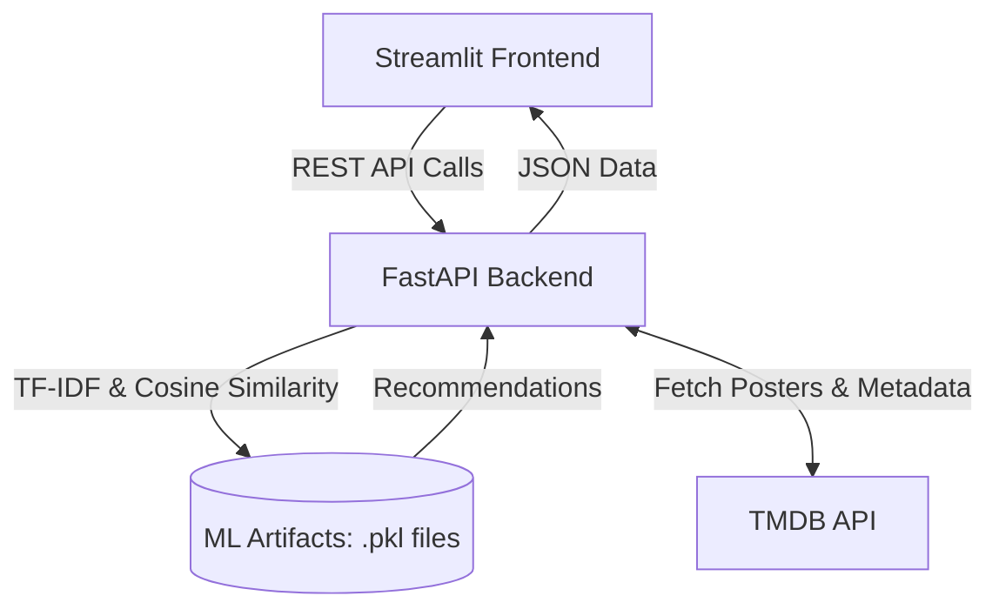

# 🎬 Movie Recommendation System


A full-stack, content-based Movie Recommendation System that leverages Machine Learning (TF-IDF and Cosine Similarity) to suggest movies based on user preferences. Built with a **FastAPI** backend and a sleek **Streamlit** frontend, integrating seamlessly with the **TMDB (The Movie Database) API** for real-time metadata and posters.

## 🚀 Live Links
- **Frontend App (Streamlit):** [Movie Recommendation System](https://movierecommendationsystem-9xfckfbqbpftjzi4qubqgf.streamlit.app/)
- **Backend API (Render):** [FastAPI Server](https://movie-recommendation-system-t86z.onrender.com)
- **API Documentation:** [Swagger UI](https://movie-recommendation-system-t86z.onrender.com/docs)

---

## 📑 Table of Contents
1. [Project Overview](#project-overview)
2. [Features](#features)
3. [System Architecture](#system-architecture)
4. [Tech Stack](#tech-stack)
5. [Machine Learning Approach](#machine-learning-approach)
6. [API Endpoints Overview](#api-endpoints-overview)
7. [Installation](#installation)
8. [Environment Variables](#environment-variables)
9. [Running Locally](#running-locally)
10. [Deployment](#deployment)
11. [Project Structure](#project-structure)
12. [Future Improvements](#future-improvements)
13. [License](#license)

---

## 📖 Project Overview
This project is an end-to-end Machine Learning web application designed to help users discover new movies. By analyzing movie metadata (genres, keywords, cast, crew, overview), the system calculates mathematical similarities between movies and provides accurate, personalized recommendations.

## ✨ Features
- **Intelligent Recommendations:** Content-based filtering using NLP techniques (TF-IDF).
- **Search Functionality:** Find movies quickly by title.
- **Detailed Movie Insights:** View overviews, release dates, runtime, and high-quality posters.
- **Genre-Based Filtering:** Browse popular movies or recommendations within specific genres.
- **Real-Time Data Integration:** Fetches up-to-date posters and additional metadata directly from the TMDB API.
- **Interactive UI:** A modern, single-page application feel built with Streamlit.
- **Robust REST API:** A fully documented (Swagger/ReDoc) FastAPI backend.

---

## 🏛 System Architecture



---

## 🛠 Tech Stack
- **Backend Framework:** FastAPI (Python)
- **Frontend Framework:** Streamlit (Python)
- **Machine Learning / Data Processing:** Scikit-Learn, Pandas, NumPy, SciPy
- **API Integration:** HTTPX, Requests (async & sync HTTP clients)
- **Environment Management:** Python-dotenv
- **Model Serialization:** Pickle
- **Deployment Platform:** Render (Backend), Streamlit Cloud (Frontend)

---

## 🧠 Machine Learning Approach
The core recommendation engine relies on **Content-Based Filtering**:
1. **Data Preprocessing:** Movie metadata (genres, keywords, cast, director) is combined into a single text "tags" column.
2. **Vectorization:** The text data is converted into numerical vectors using `TfidfVectorizer` (Term Frequency-Inverse Document Frequency), which highlights important terms while minimizing common stop words.
3. **Similarity Calculation:** The system computes the **Cosine Similarity** between the TF-IDF vectors of different movies.
4. **Artifacts:** To ensure fast API response times, the precomputed models and matrices are saved as pickle files (`df.pkl`, `tfidf.pkl`, `tfidf_matrix.pkl`, `indices.pkl`).

---

## 🔌 API Endpoints Overview
The FastAPI backend exposes several endpoints. Here are a few examples using the live deployment URL:

### 1. Health Check
Checks if the API is running.
```bash
curl -X GET "https://movie-recommendation-system-t86z.onrender.com/"
```

### 2. Search Movies
Search for a movie by title.
```bash
curl -X GET "https://movie-recommendation-system-t86z.onrender.com/search?query=Inception&limit=5"
```

### 3. Get Recommendations
Get similar movies based on a movie's ID.
```bash
curl -X GET "https://movie-recommendation-system-t86z.onrender.com/recommend/27205"
```

### 4. Get Movie Details (TMDB Integration)
Fetch detailed information from TMDB.
```bash
curl -X GET "https://movie-recommendation-system-t86z.onrender.com/movie/27205/details"
```

*(For a complete list of endpoints, visit the [Swagger UI Documentation](https://movie-recommendation-system-t86z.onrender.com/docs))*

---

## 💻 Installation

### Prerequisites
- Python 3.8+
- Git

### Steps
1. **Clone the repository:**
   ```bash
   git clone <repository_url>
   cd <repository_name>
   ```

2. **Create a virtual environment (recommended):**
   ```bash
   # using standard venv module
   python3 -m venv env
   source env/bin/activate  # On Windows use `env\Scripts\activate`
   ```

3. **Install dependencies:**
   ```bash
   pip install -r requirements.txt
   ```

---

## 🔑 Environment Variables
The application requires a TMDB API Key to fetch posters and real-time movie data.

### How to get a TMDB API Key:
1. Create an account at [The Movie Database (TMDB)](https://www.themoviedb.org/).
2. Go to your account settings.
3. Click on the **API** section in the left sidebar.
4. Request an API key (Developer type is sufficient).
5. Copy your "API Key (v3 auth)".

### Setup `.env` file:
Create a `.env` file in the root directory of the project and add your key:
```env
TMDB_API_KEY=your_tmdb_api_key_here
```

---

## 🏃 Running Locally

### 1. Start the FastAPI Backend
In a new terminal window, run:
```bash
uvicorn main:app --reload
```
The API will be available at `http://127.0.0.1:8000`.

### 2. Start the Streamlit Frontend
In a separate terminal window, run:
```bash
streamlit run app.py
```
The UI will open in your browser, typically at `http://localhost:8501`.

---

## 🌍 Deployment
- **Backend (FastAPI):** Deployed on **Render** as a web service. Render automatically builds the environment using the `requirements.txt` file and starts the server via Uvicorn.
- **Frontend (Streamlit):** Deployed on **Streamlit Community Cloud**. It connects to the backend API (configured via `API_BASE` in `app.py`).

---

## 📁 Project Structure
```text
.
├── .gitignore
├── app.py                             # Streamlit frontend application
├── main.py                            # FastAPI backend application
├── requirements.txt                   # Python dependencies
├── runtime.txt                        # Specifies Python version for deployment
├── movie_recommendations_system.ipynb # Jupyter notebook for data exploration and model training
├── df.pkl                             # Pickled pandas DataFrame (movie data)
├── indices.pkl                        # Pickled pandas Series (movie title to index mapping)
├── tfidf.pkl                          # Pickled TF-IDF Vectorizer model
├── tfidf_matrix.pkl                   # Pickled TF-IDF matrix
├── LICENSE                            # MIT License
└── README.md                          # Project documentation
```

---

## 🔮 Future Improvements
- **Collaborative Filtering:** Integrate user ratings to provide hybrid recommendations (Content + Collaborative).
- **User Authentication:** Allow users to create accounts, save their favorite movies, and maintain a watchlist.
- **Advanced Search:** Add filters for release year, cast members, and runtime.
- **Caching Mechanisms:** Implement Redis or in-memory caching to further speed up TMDB API responses.

---

## 📜 License
This project is open-source and available under the [MIT License](LICENSE).
